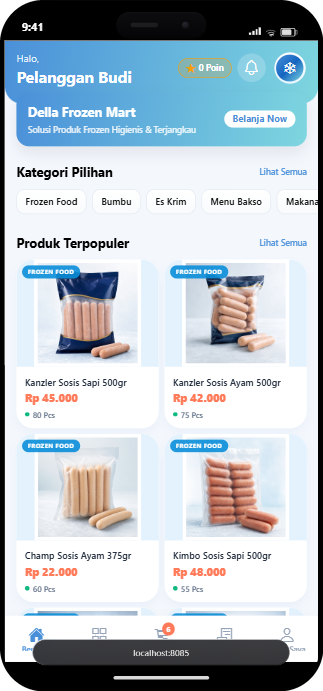
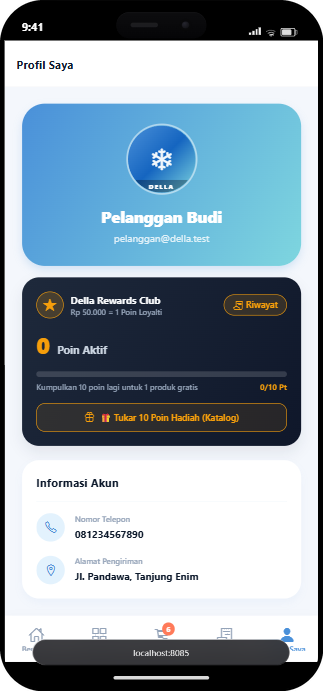
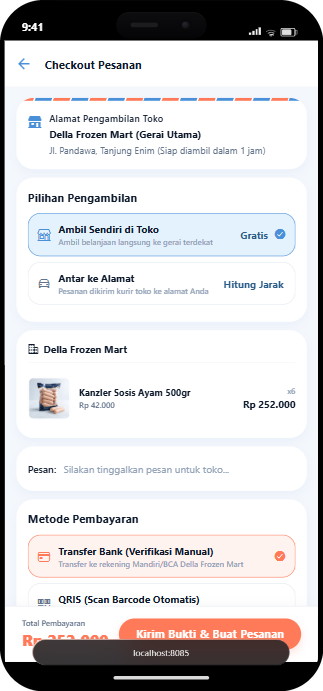
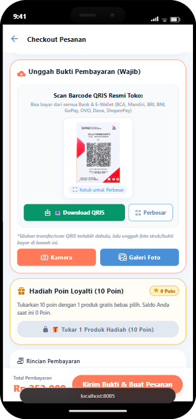
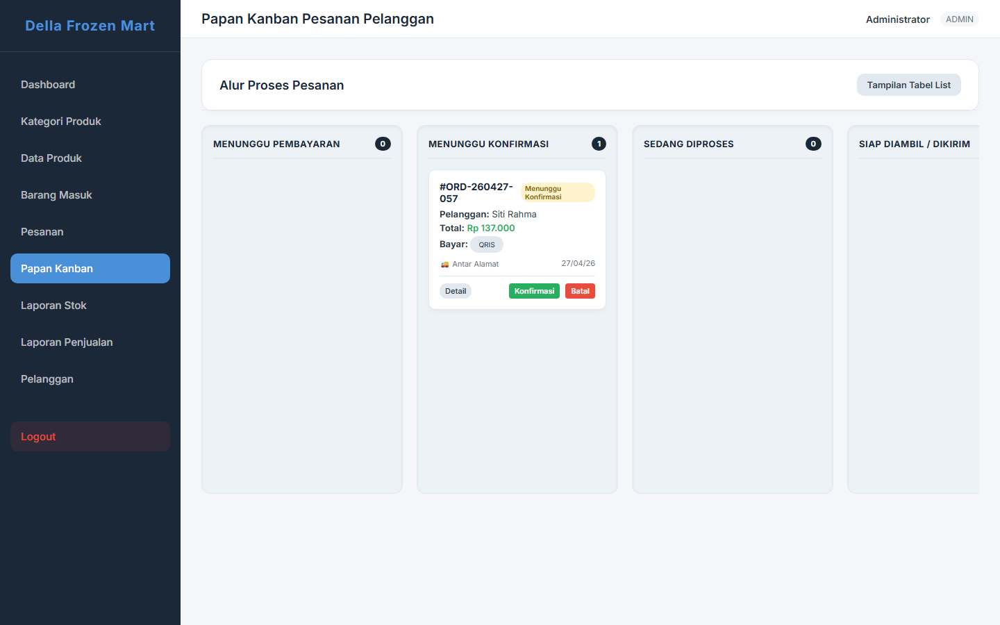
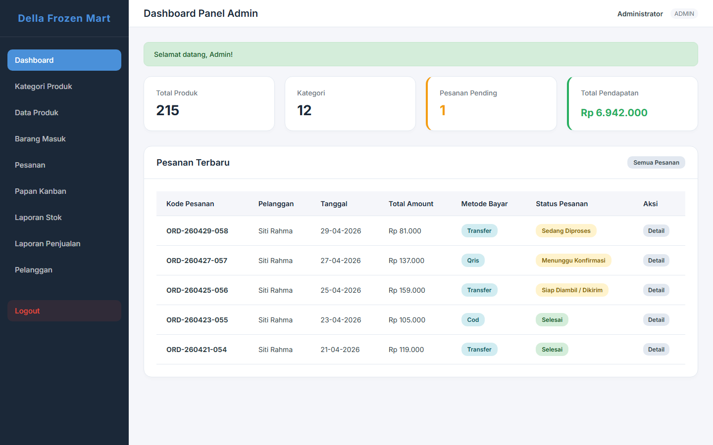

# FrostMart — Hyperlocal Quick Commerce & Mobile E-Commerce Platform

[](https://reactnative.dev/)
[](https://expo.dev/)
[](https://laravel.com/)
[](https://www.php.net/)
[](https://www.mysql.com/)
[](https://phpunit.de/)
[](LICENSE)

**FrostMart** is a production-grade, full-stack quick commerce platform engineered specifically for cold-chain grocery and hyperlocal retail logistics. Built with a **React Native (Expo SDK 54)** cross-platform mobile client and a **Laravel 11 RESTful API & Blade Management Web Portal**, the platform unifies Customers, Store Cashiers/Admins, and Business Owners into an end-to-end synchronized retail workflow.

---

## 📸 Visual Showcase & Previews

### 1. Customer Mobile Experience & Loyalty Rewards Engine
A streamlined shopping journey featuring live catalog filtering, flash offers, multi-method fulfillment checkout, and a gamified customer loyalty points reward club.

| 🏠 Catalog & Deals | 🎁 Loyalty Rewards Club | 🛍️ Multi-Fulfillment Checkout | 📱 Dynamic QRIS & Proof |
|:---:|:---:|:---:|:---:|
|  |  |  |  |

### 2. Real-Time Kanban Order Pipeline & Dispatch Hub
Interactive multi-stage order workflow featuring live status transitions (Menunggu Pembayaran, Menunggu Konfirmasi, Sedang Diproses, Siap Diambil/Dikirim), single-modal courier assignment, and instantaneous order filtering.



### 3. Store Admin Operations & Executive Business Analytics
Full web management portal featuring live revenue analytics, daily order throughput, product catalog control, and automated audit activity logging.



---

## ⚡ Key Engineering Highlights

### 🎁 1. Automated Customer Loyalty Points Engine
- **Formula:** Earns **1 Point per Rp 50.000** spent (applied automatically upon order completion). Points are permanent and never expire.
- **Redemption:** **10 Points = 1 Free Product** of choice from active inventory.
- **Dual Redemption Flow:**
  1. *In-Checkout Redemption:* Select a bonus item right inside `CheckoutScreen` (credited at Rp 0).
  2. *Direct Profile Claim:* Redeem reward items instantly from the profile loyalty card without needing a shopping cart order.
- **Concurrency & Safety:** Idempotent database transactions with pessimistic row locking and automatic point refunds if an order is cancelled.

### 🗺️ 2. Spatially-Aware Geocoding & Satellite Imagery (2.138 Local OSM Points)
- **Local Spatial Dataset:** Over 2,138 mapped locations from OpenStreetMap Overpass API covering streets, POIs, markets, hospitals, and residential areas.
- **Multi-Layer Geocoding Pipeline:** Resolves coordinates using a 4-tier fallback: Local Cache Engine $\rightarrow$ Google Maps API $\rightarrow$ Photon Komoot $\rightarrow$ Nominatim OSM.
- **Radius Guard:** Strictly enforces a 10 KM delivery perimeter using the Haversine formula, offering intelligent fallback options for pickup outside the zone.
- **ArcGIS Satellite View:** Seamless live toggle between standard vector map tiles and high-resolution ArcGIS World Imagery.

### 📲 3. Offline-First QRIS Payment Storage
- Resolves Expo SDK 54 file-system modernizations by utilizing `expo-file-system/legacy` and `expo-sharing`.
- Customers can download and share payment barcodes directly to device galleries via Base64 rendering in milliseconds—zero external network required during scanning.

### 🔔 4. Real-Time Notification & Live Chat Hub
- **Two-Way Order Chat:** Integrated communication channel per order between customer and admin with unread tracking badges.
- **Global Drop-Down Heads-Up Banner:** Spring-animated in-app notification overlay (`NotificationContext`) that slides down across all screens with native vibration and iOS chime audio.
- **In-Flight Lock Protection:** Prevents network request congestion and eliminates `AbortError` drops during connectivity transitions.

### 📊 5. Multi-Role Management Architecture
| Role | Portal / Client | Key Capabilities |
|---|---|---|
| **Customer** | Mobile App (iOS / Android) | Catalog browsing, address pinpointing, order tracking, points redemption, live order chat. |
| **Admin / Kasir** | Web Portal & Mobile Screen | Kanban order pipeline, single-modal courier assignment, thermal receipt printing, stock-in entry. |
| **Business Owner** | Web Portal & Mobile Screen | Executive revenue dashboards, top-selling product leaderboard, loyalty program ROI, and auditable activity logs. |

---

## 🛠️ Technology Stack

- **Mobile Client:**
  - React Native 0.76 & Expo SDK 54
  - React Navigation 7 (Stack & Bottom Tabs)
  - React Native Maps (ArcGIS Satellite Tiles)
  - Lucide React Native Icons
  - Context API with In-Flight Ref Protection
- **Backend & Web Management:**
  - PHP 8.2+ & Laravel 11.x
  - Laravel Sanctum (Token-Based REST Authentication)
  - MySQL 8.0 Database
  - Blade Templating Engine (Tailwind CSS)
  - Maatwebsite Excel (Sales & Stock Export)
- **Testing & Quality Assurance:**
  - PHPUnit 11 with 64 automated feature/unit test suites (250 assertions passing).
  - Babel / AST syntax validation across all React Native components.

---

## 📂 Project Structure

```text
frostmart-ecommerce-mobile-app/
├── backend_api/                 # Laravel 11 REST API & Blade Management Web
│   ├── app/
│   │   ├── Console/Commands/    # Spatial OSM import commands
│   │   ├── Http/Controllers/    # API & Web Controllers (Auth, Order, Point, Geo)
│   │   ├── Models/              # 15 Eloquent Models with loyalty & order relations
│   │   └── Services/            # PointService, StockService
│   ├── database/
│   │   ├── migrations/          # Structured MySQL schema migrations
│   │   └── seeders/             # Initial seeder data & 2.138 geocache points
│   ├── resources/views/         # Admin & Owner Blade templates (Kanban, Reports)
│   ├── routes/                  # api.php, web.php, console.php
│   ├── tests/Feature/           # 64 Automated Feature Tests
│   ├── .env.example             # Clean environment template
│   └── composer.json
├── mobile_app/                  # React Native & Expo Mobile Client
│   ├── src/
│   │   ├── components/          # Reusable UI & Loyalty Modals
│   │   ├── context/             # AuthContext, OrderContext, NotificationContext
│   │   ├── core/                # api.js, notificationService.js
│   │   ├── navigation/          # AppNavigator.js (Stack & Tabs)
│   │   ├── screens/             # 28 Screens (Customer, Admin, Owner, Address)
│   │   └── utils/               # qrisHelper.js, reportExportHelper.js
│   ├── assets/                  # App icon, splash screen, QRIS asset
│   ├── App.js & app.json
│   └── package.json
├── docs/
│   ├── screenshots/             # High-resolution portfolio visual previews
│   └── specs/                   # Technical architecture & design specifications
├── .gitignore
└── README.md
```

---

## 🚀 Getting Started

### Prerequisites
- Node.js (v18.x or v20.x LTS)
- PHP 8.2+ with `pdo_mysql`, `mbstring`, `fileinfo` extensions
- Composer 2.x
- MySQL 8.0+

### 1. Backend API Setup
```bash
# Navigate to backend directory
cd backend_api

# Install PHP dependencies
composer install

# Configure environment
cp .env.example .env
php artisan key:generate

# Run database migrations and seeders
php artisan migrate --seed

# Link public storage for product media
php artisan storage:link

# Start the local development server
php artisan serve
```

### 2. Mobile App Setup
```bash
# Navigate to mobile directory
cd mobile_app

# Install Node dependencies
npm install

# Start the Expo development server
npx expo start
```

---

## 🔑 Demo & Test Accounts

| Role | Email | Password | Access Portal |
|---|---|---|---|
| **Customer** | `pelanggan@dellafrozenmart.test` | `password` | Mobile App (iOS / Android) |
| **Admin** | `admin@dellafrozenmart.test` | `password` | Web Admin (`/admin`) & Mobile |
| **Owner** | `owner@dellafrozenmart.test` | `password` | Web Owner (`/owner`) & Mobile |

---

## 🧪 Automated Testing

FrostMart includes a comprehensive PHPUnit feature test suite covering authentication, stock mutations, order workflows, and loyalty point operations:

```bash
cd backend_api
php artisan test
```

```text
Tests:    64 passed (250 assertions)
Duration: 3.42s
Status:   100% PASSING
```

---

## 👨‍💻 Author

**Fajar Romadhan**
- GitHub: [@fajar-romadhan](https://github.com/fajar-romadhan)

---

## 📄 License

This project is licensed under the [MIT License](LICENSE).

